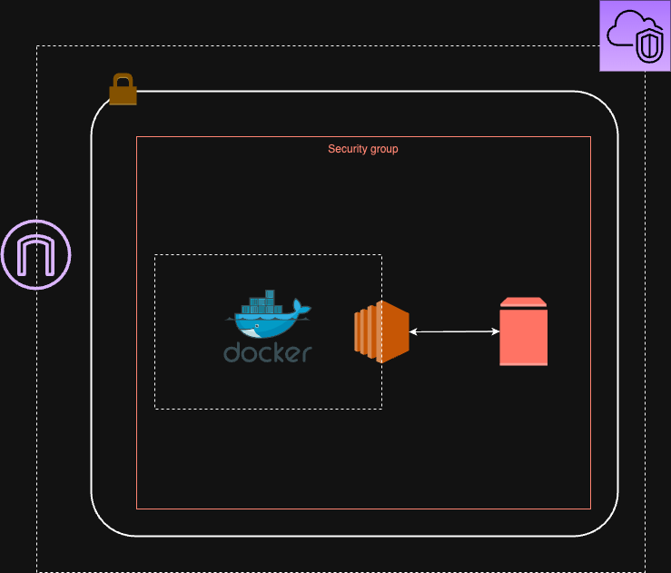
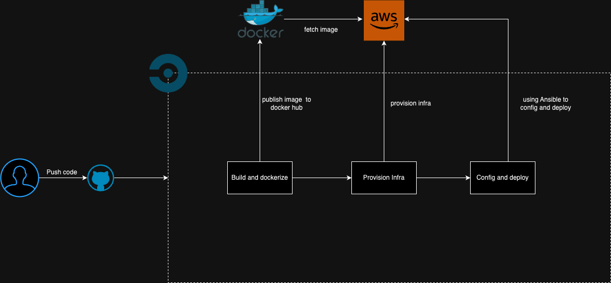

# File Management System

1. Tech stacks
2. Architecture
3. Pipeline
4. Local run

### Tech stacks
This project is using these tech stacks: 

- Backend: Python
- Containerize: Docker, Docker Compose
- Cloud Native: AWS
- Infrastructure as Code: Terraform
- Configuration as Code: Ansible
- CI tool: Circle CI

### Architecture

### Pipeline:

