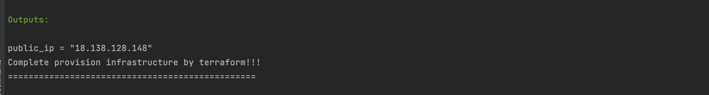

# Running Project Locally

1. [Run the code locally](#run-the-code-locally)
2. [Provision your infra + test ansible](#provision-your-infra-and-deploy-application)
3. [Destroy infra](#destroy-infra)

### Run the code locally

If you want to test the application, you can do these steps:

- Ensure that already installed docker + docker-compose. If not, follow [this](https://docs.docker.com/compose/install/) to install.
- Run this command to build and start locally: _**docker-compose -f ./local/docker-compose.yml up  -d --build**_
- Go to _http://localhost:8080_ to test the application
- Run this command to shut down the app: **_docker-compose -f ./local/docker-compose.yml down_**

### Provision your infra and deploy application

##### Prerequisite:

There are some prerequisites before start provision infra and deploy:
- Setup aws environment: install [aws-cli](#https://docs.aws.amazon.com/cli/latest/userguide/getting-started-install.html), after that follow [this user guide](#https://docs.aws.amazon.com/cli/latest/userguide/getting-started-quickstart.html) to set up aws profile on the local machine.
- Install terraform: follow [this user guide](#https://developer.hashicorp.com/terraform/tutorials/aws-get-started/install-cli) to install terraform
- Install Ansible: follow [this user guide](#https://docs.ansible.com/ansible/latest/installation_guide/intro_installation.html) to install ansible
- Generate ssh key: run the command **_ssh-keygen -t RSA_** to generate the ssh key
- Create S3 bucket to store terraform state: create a bucket on AWS S3 to store tfstate file
- Set up environment variables:
  1. export DOCKER_USERNAME={username} : username of docker hub repository
  2. export DOCKER_PASSWORD={password}: password for the username
  
#### Actions

After complete the [Prerequisite](#prerequisite), run this command to provision infra and deploy app: _**sh ./local/provision_and_deploy.sh {public_key_path} {private_key_path} {terraform_bucket}**_
 
with:
- _public_key_path_: the public ssh key path that is generated in the [Prerequisite](#prerequisite) part, ex: ~/.ssh/id_rsa.pub 
- _private_key_path_: the private ssh key path that is generated in the [Prerequisite](#prerequisite) part, ex: ~/.ssh/id_rsa
- _terraform_bucket_: the bucket to store the terraform state file that is generated in the [Prerequisite](#prerequisite) part, ex: test-terraform-state-527552148303.  
 
   Example command:  sh ./local/provision_and_deploy.sh ~/.ssh/id_rsa.pub ~/.ssh/id_rsa "test-terraform-state-527552148303"

After the shell run successful, pls look into the terminal window, you'll see the public ip for the test server, try to access this ip on the browser to test the application on the AWS

### Destroy infra

After the testing is completed, pls run this command to destroy the test environment: **_sh ./local/destroy_infra.sh {terraform_bucket}_**  
with: 

- _terraform_bucket_: the bucket to store the terraform state file that is generated in the [Prerequisite](#prerequisite) part, ex: test-terraform-state-527552148303.  

Example command:  sh ./local/destroy_infra.sh "test-terraform-state-527552148303" 